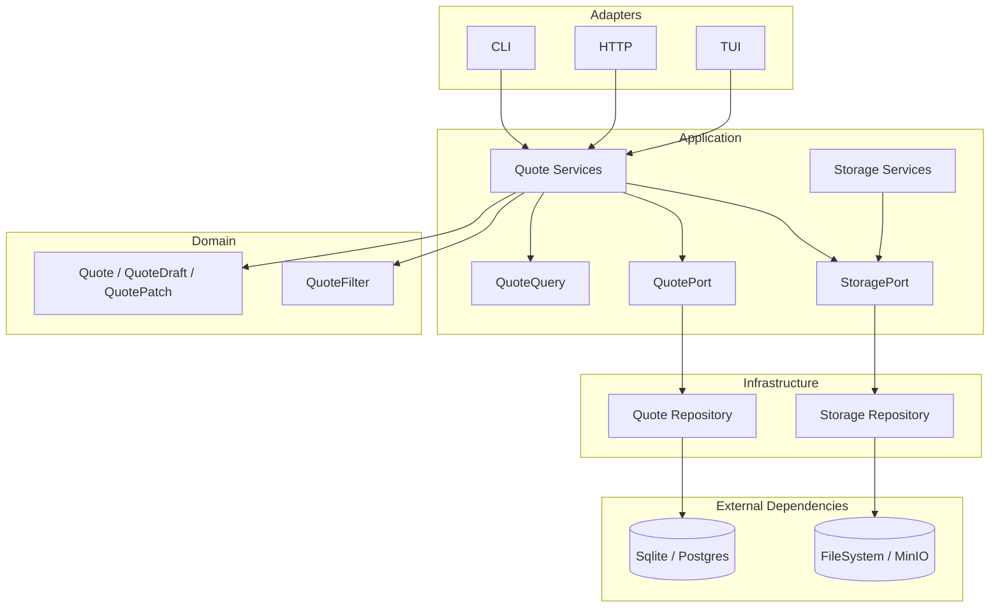
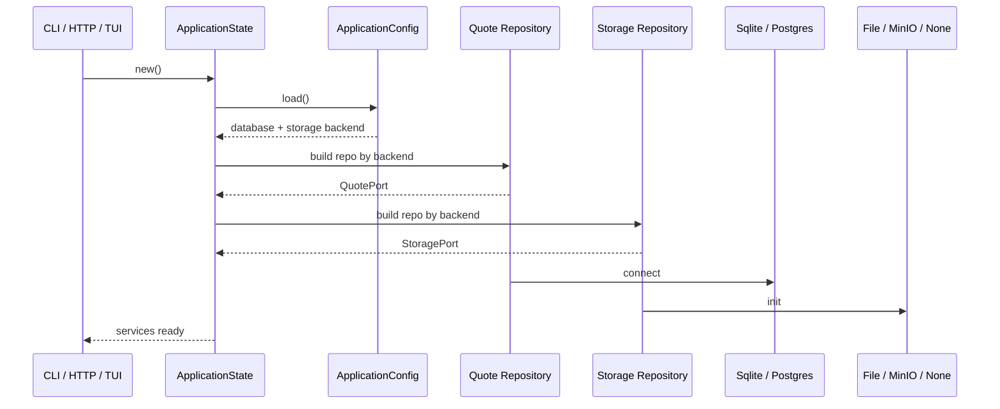
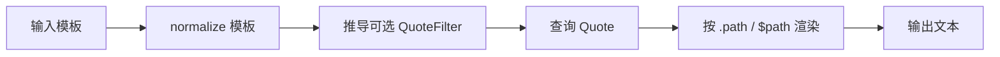
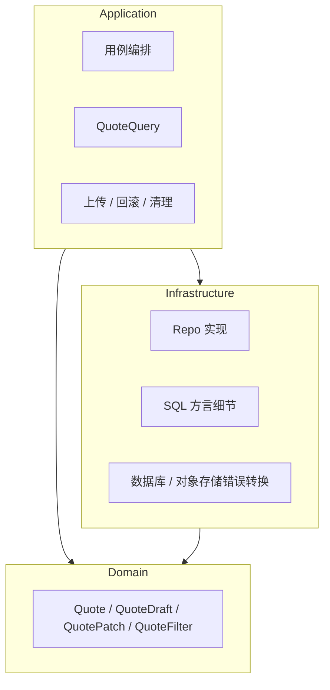

# azvs_quote

`azvs_quote` 是一个以 CLI 为主的 Quote 管理工具，采用 DDD 分层，支持：
- Quote 数据 CRUD
- 对象存储（external/markdown/image）上传下载
- `--format` 模板渲染（`.path` / `$path`）
- 图片 `meta` / `ascii` / `view` 三种输出模式

当前仓库版本：`0.3.0`

## 快速笔记（Git 提交）

```bash
git push origin master
git push github master
```

下游仓库同步上游代码并开发流程
```bash
# git remote add upstream https://github.com/azvs32/quote
# 验证远程列表
git remote -v
# 拉取上游仓库所有最新改动
git fetch upstream
# 切换到你本地的主分支
git checkout master
# 合并 upstream/master
git merge upstream/master
# 同步到下游 Fork
git push origin master

# 开始新功能开发
git checkout -b new-branch
# ... 完成开发后
git add .
git commit -m "xxx"
git push origin new-branch
```

## 快速开始（30 秒）

```bash
cargo build --release
./target/release/quote list --limit 3
```

默认行为：
- 数据库 backend 默认是 `sqlite`
- 数据库文件默认是 `~/.config/azvs/quote.db`
- 不会自动初始化数据库；需手动创建库和表
- 存储 backend 默认是 `file`
- 文件存储根目录默认是 `quote.toml` 同目录下的 `data/`

## 配置

完整配置参考见：[docs/config.md](docs/config.md)

## 接口文档

- CLI: [docs/cli.md](docs/cli.md)
- HTTP API: [docs/http-api.md](docs/http-api.md)
- TUI: [docs/tui.md](docs/tui.md)

## 构建与测试

```bash
cargo build --release
cargo test
```

## 架构概览



## 项目流程（端到端）

下面按“请求从入口到落库/存储”的顺序，用图说明当前实现。

### 应用启动与依赖装配



### 模板渲染流程（--format）



### 分层职责



## 已知待办

- 使用 `sqlx migrate` 替代手工 SQL 初始化管理。（暂时感觉，手动管理SQL也挺好）
- 为 Quote 更新链路补充“事务 + 行锁/等价并发控制”
  - 当前已引入 `QuotePatch`，目的是把“更新 Quote 的业务语义”收回领域模型：由 `QuotePatch` 表达本次变更，由 `Quote::apply(...)` 统一完成合并和最终合法性校验，避免仓储层自行决定业务规则。
  - 但目前 `update` / `partial delete` 仍是典型读改写流程：应用层先读取旧值并组装补丁，仓储层更新时又会再次读取当前值；在并发场景下，可能发生后写覆盖先写的问题。
  - 后续需要在仓储实现中补事务与行锁，或引入版本号/乐观锁，确保“读取当前 Quote -> 应用 `QuotePatch` -> 写回”的过程具备原子性，避免并发更新丢失。
