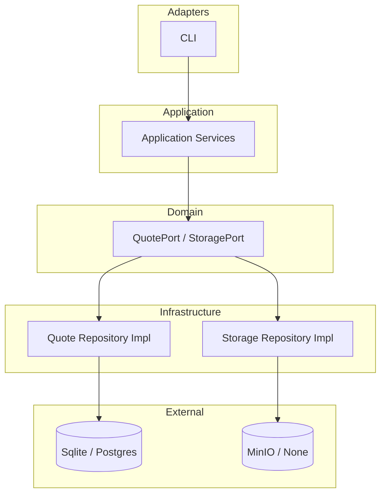

# azvs_quote

`azvs_quote` 是一个以 CLI 为主的 Quote 管理工具，采用 DDD 分层，支持：
- Quote 数据 CRUD
- 对象存储（external/markdown/image）上传下载
- `--format` 模板渲染（`.path` / `$path`）
- 图片 `meta` / `ascii` / `view` 三种输出模式

当前仓库版本：`0.2.3`

## 快速笔记（Git 提交）

```bash
git push origin master
git push github master
```

## 快速开始（30 秒）

```bash
cargo build --release
./target/release/quote list --limit 3
```

默认行为：
- 数据库 backend 默认是 `sqlite`
- 数据库文件默认是 `~/.config/azvs/quote.db`
- 不会自动初始化数据库；需手动创建库和表
- 存储 backend 默认是 `none`（不依赖 MinIO）

## 配置

完整配置参考见：[docs/config.md](docs/config.md)

## 接口文档

- CLI: [docs/cli.md](docs/cli.md)
- HTTP API: [docs/http-api.md](docs/http-api.md)
- TUI: [docs/tui.md](docs/tui.md)

## 构建与测试

```bash
cargo build --release
cargo test
```

## 架构概览



## 已知待办

- 使用 `sqlx migrate` 替代手工 SQL 初始化管理
